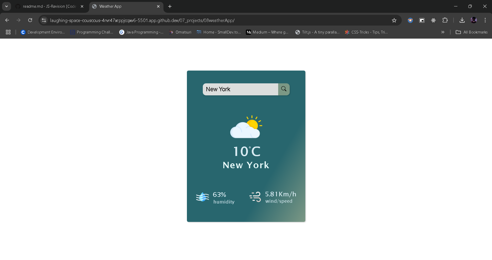

# create weather card 
- it is a simple card where i display all details like temperature,  humidity, wind speed, city name, these all details  are display when you search any cety name in search box.

# how to create 
- I used HTML to create a card 
- I used css to modify that card and  make it look attractive
- using java script make that card work dynamicaly when you search city name in search box according all details will change.
- for doing this i used weather api to get current weather data (using async & await)
- And convert that datain object form using Json().
- Now it allow us to used it according to your need 

# Screan Shots :- 
